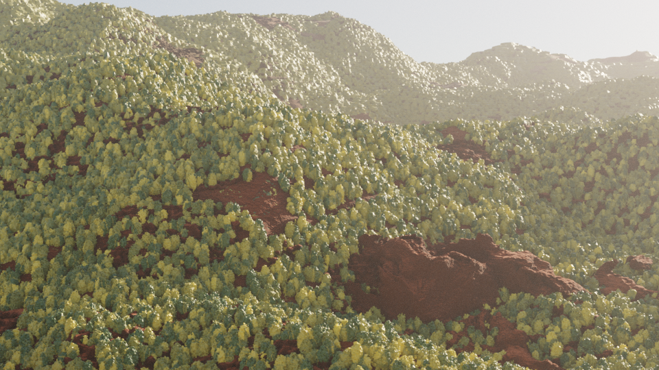
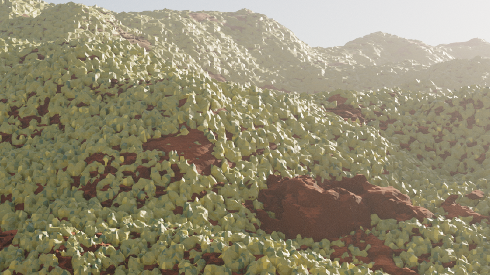
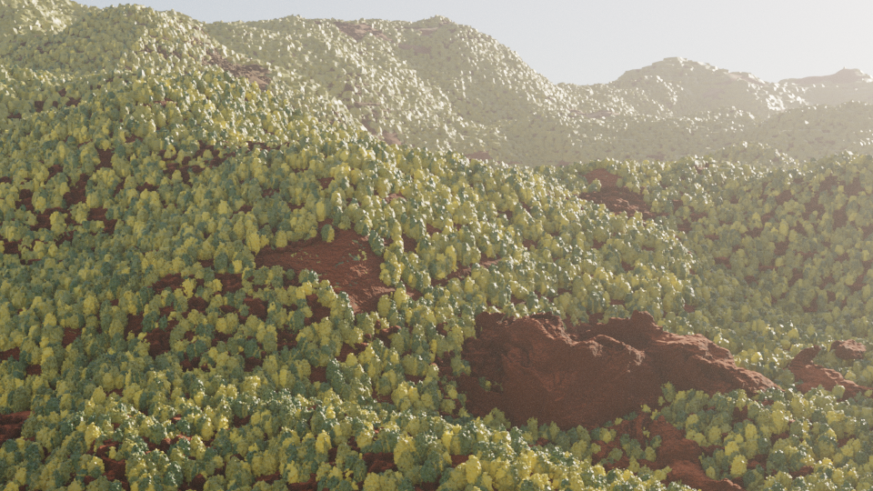
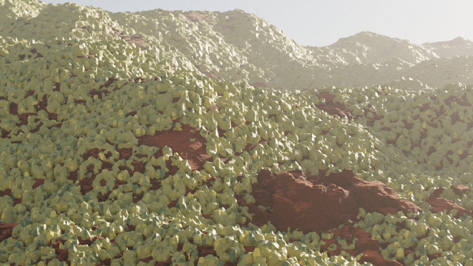
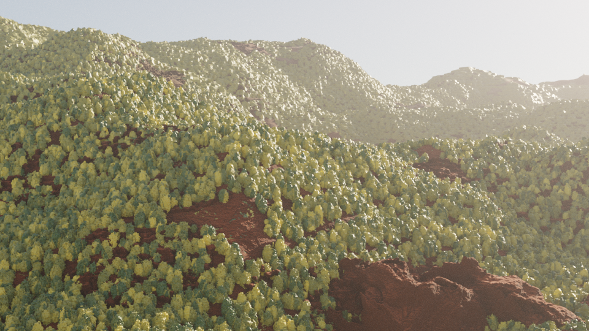
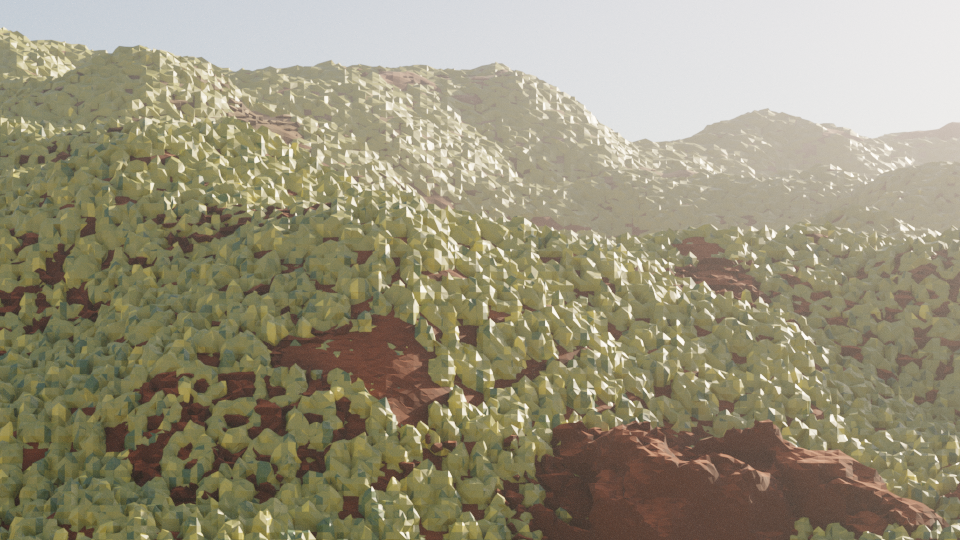
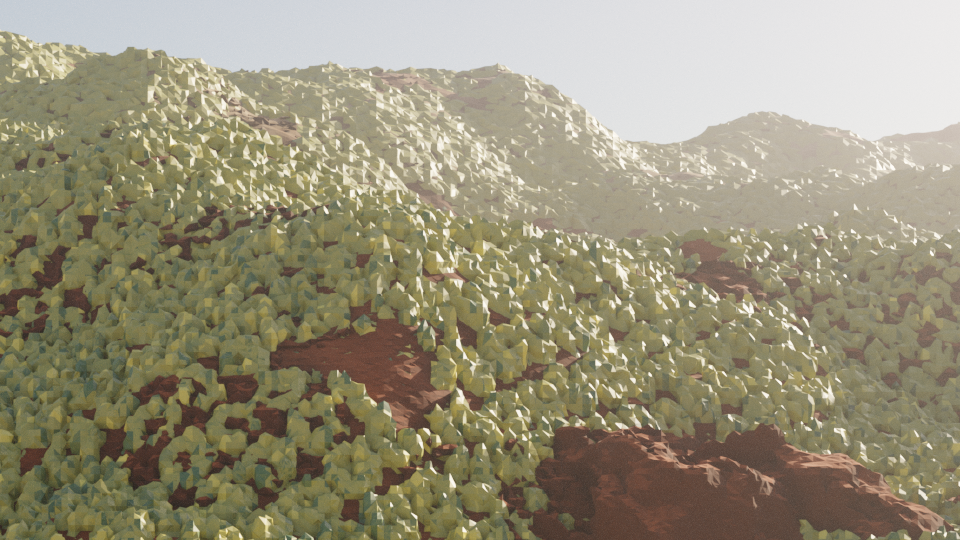

# Forest 96-frame pilot: archived baseline results

These are **local pilot measurements of two external baselines**, not numbers
copied from the paper and not evidence that BEB1/SSP1 improves BinocMesher.
OcMesher-96 completed on 2026-09-05 at 14:18:03 +08:00. Spherical-8 images
come from the earlier completed run and were rescored with the corrected v2 evaluator.

## Configuration and results

Both methods: Forest, seed 0, frames 1-96 at 24 fps (4 seconds), 960x540,
pixels-per-cube = 6, 3072 beauty samples, OMP 8. Each has 96 images,
96 saved flow arrays and 95 adjacent-frame SSIM pairs. This is not the full
six-scene, 480-frame-per-scene experiment or the final higher-quality preset.

| Measured quantity | OcMesher-96 | Spherical-8 |
| --- | ---: | ---: |
| Full-image warped SSIM mean | 0.948585 | 0.906415 |
| Full-image warped SSIM median | 0.947756 | 0.948741 |
| Full-image warped SSIM P1 | 0.940812 | 0.545236 |
| Full-image warped SSIM minimum | 0.940638 | 0.543974 |
| Full-image SSIM jump maximum | 0.001820 | 0.818812 |
| Full-image SSIM jump P99 | 0.001566 | 0.812444 |
| Valid-support warped SSIM mean | 0.959328 | 0.916932 |

The full-precision results are in each method's `ssim/summary.json` and
`ssim/per_frame.csv`. The flow convention is schema `binoc-warped-ssim-v2`:
sample the next image at `(x - raw_flow_x, y + raw_flow_y)`. Full-image scores
include black out-of-bounds warp regions. Valid-support scores exclude invalid
warp support, **not occlusions**. Jump strength is `S[i-1] + S[i+1] - 2*S[i]`,
with 93 interior positions. See the [evaluator](../../warped_ssim.py) for the
exact implementation; these scores should not be treated as an independently
verified numerical reproduction of the paper's evaluator.

OcMesher-96's recovery queue elapsed time was 13,206 seconds (3 h 40 min 6 s),
with manager/scorer exit codes 0. It reused an existing coarse scene, so this
is **not a cold-start end-to-end timing**. Spherical's historical queue row
reports 7,688 seconds, but used the earlier evaluator; it is not a matched
timing comparison for the v2 scores.

## What these results do and do not show

- This window has a higher mean and better low-tail SSIM for OcMesher-96 than
  Spherical-8; Spherical-8 has a slightly higher median. Do not claim superiority
  on every statistic or across all scenes from this pilot.
- Frames 1-96 do **not** include the OcMesher-96 transition from 96 to 97.
  Spherical-8 does include its shorter mesh-block transitions. This limits
  conclusions about long-sequence temporal stability.
- Neither a corrected 96-frame original Binoc baseline nor the full BEB1/SSP1
  method has been evaluated here. OcMesher-24 and Binoc were deferred at the
  user's request after OcMesher-96 finished.
- Old Binoc images held a slice fixed for 24-frame blocks and are invalid for
  temporal comparisons. They are excluded. Old v1 SSIM used an incorrect flow
  x sign; only v2 scores are included in the score folders here.
- The Binoc JSON checks below validate a two-frame, 8-sample pipeline smoke
  test and a rejection guard. They are not a quality benchmark or BEB1 census.

## Selected same-frame renders

These are unchanged 960x540 PNGs, not AI-generated, retouched, or recompressed.
Selection was deliberate: 16/17 covers Spherical's worst valid-support pair;
48/49 adds another Spherical block boundary. They are diagnostic examples, not
a random or exhaustive sample. Both methods use the same selected frame IDs.

| Frame | OcMesher-96 | Spherical-8 |
| --- | --- | --- |
| 16 |  |  |
| 17 |  |  |
| 48 |  |  |
| 49 |  |  |

Each `ssim/` folder also contains the current, next and warped-next image for
that method's **minimum valid-support SSIM** pair: OcMesher-96 30->31 and
Spherical-8 16->17. Those two triplets are **not a same-frame comparison**.

## Archive contents and provenance

- `ocmesher96/` and `spherical8/`: complete v2 score tables, four selected RGB
  frames each, three diagnostic images each, original manager command, and
  operative configuration logs for the first fine-terrain, beauty and GT task.
  The command captures the original invocation; its absolute paths must be
  adapted before reuse. The three configuration logs are representative, not
  a complete per-task log archive.
- `checks/`: Binoc multi-frame rejection, per-frame slicing audit, and Binoc
  and Spherical depth/camera flow-direction checks.
- `provenance/recovery_manifest.txt` and `recovery_status.tsv`: the completed
  OcMesher-96 run, including its narrowed scope.
- `provenance/original_manifest.txt` and `original_status.tsv`: historical
  context for the reused Spherical images. **Do not interpret the old batch's
  finish timestamp or Binoc success row as validation**: Oc runs failed there
  and Binoc slicing was invalid. The historical scorer rows also predate v2.
- `artifact_manifest.json`: original source paths, byte sizes and SHA-256
  hashes for all 34 copied artifacts. It intentionally does not hash itself
  or this authored README. Copied files were verified byte-for-byte.

The runs were made from base commit
`ae81991c5d2cd8788f4340bbac4e3a934f71ef9c` with local modifications; the pipeline
repairs and v2 scoring code were subsequently archived in
`91e70eaf582c272b846072e7042fb528539fa76d`. The run manifest records the actual
checkout, not a claim that the later commit was already checked out at launch.
Infinigen's base submodule commit was
`3816586c07dada9adbb963d0e1b518f6fee0e71c`; the relevant compatibility edits are
preserved in [infinigen_compat.patch](../../infinigen_compat.patch).

## Storage and reproducibility limits

The selected copied payload is 13,567,470 bytes (about 12.94 MiB), including
14 PNGs. No mesh/cache binaries, EXR passes, flow arrays, environments, or full
image sequences are committed. Complete raw-input SSIM recomputation therefore
requires the retained local runs; **this repository package is not a full backup**.
The per-frame CSVs are sufficient to independently check the aggregate statistics.
Source paths in the manifest document provenance and are not portable dependencies.

See [rendering instructions](../../README.md) and the
[earlier repair-validation checkpoint](../../VALIDATION_20260905.md). This archive
supersedes that checkpoint's statement that OcMesher-96 was still running.
